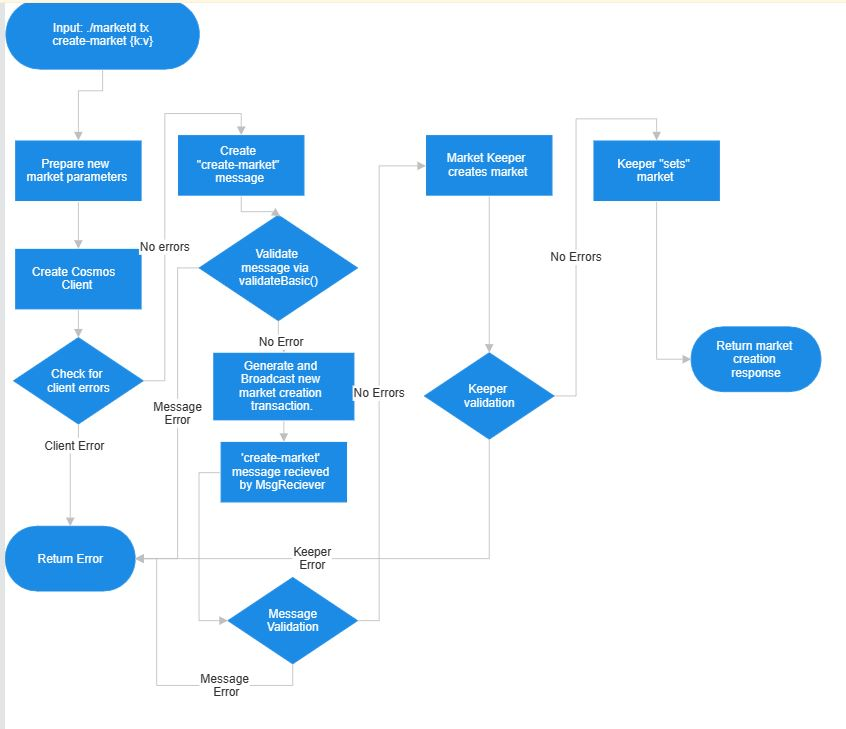

# Switcheo Backend Internship - Problem 6 - System Design - Jun Han Huang
## 'create-market' Execution Flow Diagram

## Overview

Firstly, the market module is intended to facilitate the creation and manipulation of financial markets. 

With this in mind, I assume that some relevant stakeholders are financial entities who need to create / manipulate financial markets. 

As such, I can propose that some key non-functional requirements (requirements other than the necessary key functions) are security (financial data must be secure), and consistency (financial operations must be well-documented and predictable).

## Evaluation and Improvements 

In this solution, the combined features of CosmosSDK and Ignite CLI does increase its consistency: Abstraction provided by the keeper feature prevents unecessary access from other modules. The use of messages to manipulate markets provides built-in verification and validation in addition to creating familiar documentation for how to use any given module. Lastly, the automatic generation of code from Ignite CLI reduces the chance of human error during development. 

In addition, the strong typing of CosmosSDK increases security as the likelihood of mismatched type induced errors is reduced. 

In terms of improvements, the heavy reliance on CosmosSDK and Ignite CLI could detrimentally affect module in both time and memory performance. The constant error checking and frequent generation of custom types for each module could slow down performance. However, given the emphasis on consistency and security in finance, it may make sense to sacrifice performance for the sake of better reliability.
